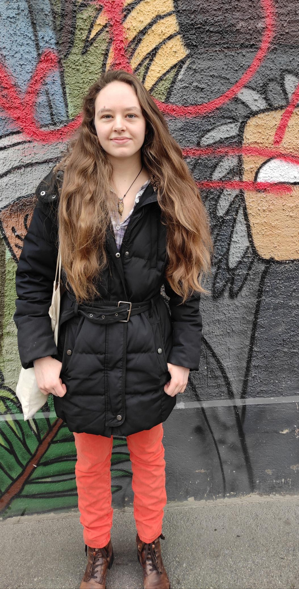

+++
title = "Was bewegt einen die Welt zu einem besseren Ort zu machen."
date = "2024-06-12"
draft = false
pinned = false
image = "raphael-renter-raphi_rawr-wtbr7ionz_0-unsplash-1-.jpg"
+++
Queerer Aktivismus und queere Aktivist*innen werden immer wichtiger, um auf die Rechte von queeren Menschen aufmerksam zu machen. Besondere Wichtigkeit bekommt das Thema in der jetzigen Zeit, in der weltweit, aber auch bei den Europawahlen, ein klarer Rechtsruck zu sehen ist. In dieser Reportage geht es um queeren Aktivismus, wie er Menschen bewegt, warum er wichtig ist und vieles mehr.



Queerer Aktivismus

Queerer Aktivismus setzt sich für die Rechte und Anerkennung von LGBTQ+ Personen ein. Er umfasst Maßnahmen wie Proteste, Aufklärung, rechtliche Kämpfe und soziale Unterstützung, um Diskriminierung zu bekämpfen und Gleichberechtigung zu fördern. Aktivisten streben danach, gesellschaftliche Normen zu verändern, damit Menschen unabhängig von ihrer sexuellen Orientierung oder Geschlechtsidentität frei und sicher leben können.



Nervös stand ich vor dem Restaurant, während ich auf meine Interviewperson wartete. Bis mir die Realisierung, dass ich weder wusste, wie sie aussieht, noch wie sie zu erreichen war, da wir nur über E-Mails kommuniziert hatten, förmlich ins Gesicht schlug. Ich schaute mich um, um sicherzustellen, dass ich auch wirklich am Eingang stand. Die Tür, auf der unter anderem groß "Eingang" aber auch Aufrufe zu Protestaktionen und anderen Aktivismus stand, beruhigte mich jedoch wieder. Einige Minuten später wurde ich dann von einer Person, mit langen hellbraunen Haaren und einem Business Casual Look angesprochen, die sich als meine Interviewperson, Lena Maria Carnal, herausstellte. Vor dem Eintreten in das Restaurant wurde noch ein Bild von ihr vor der mit Graffiti verzierten Wand geschossen. Sie gingen in das Innere des Cafés, in welchem sich allerlei Menschen zusammengefunden hatten, von verschiedener Herkunft, Alter und Aussehen. Im Außenbereich redeten alle laut miteinander, während der Sonnenschein einen wärmte, jedoch die kühle Brise einen daran erinnerte, dass der Winter noch nicht seit langem vorbei war. An einem Platz unter einem großen Baum, mit Blick auf das Innere des Cafés und seine Wände, setzten sie sich.

**Was bewegt einen zum Aktivismus**

Lena Maria Carnal hatte schon während der gymnasialen Zeit mit Aktivismus angefangen. Begonnen hat alles mit einer Klimademo 2019, dort verspürte sie zum ersten Mal, wie es sich anfühlt, Plakate mit ihren Freunden zu gestalten, das Gemeinschaftsgefühl davon, dass sich eine große Menge von Menschen für eine gemeinsame Sache versammelt hat, und der Ruf von Parolen als Gruppe, die alle Veränderung fordern. All diese Dinge erinnern daran, dass man nicht allein auf dieser Welt den Wunsch nach Veränderung im Herzen trägt.

> «Bei Demonstrationen ist immer eine sehr coole Stimmung, finde ich, dass alle für ein Thema gemeinsam einstehen und diese Parolen rufen. Das gibt dann einen extremen Zusammenhalt und auch sehr viel Kraft, sich weiter einzusetzen.»