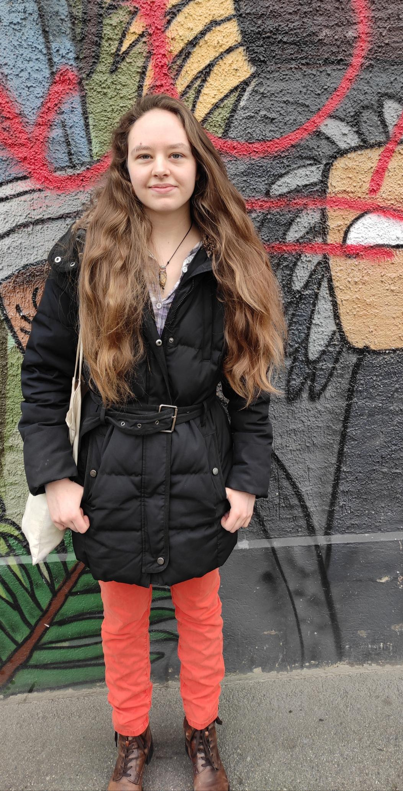

+++
title = "Wie ein jeder diese Welt bewegen kann"
date = "2024-03-15"
draft = false
pinned = false
tags = ["LGBTQIA+", "Awareness", "Interve", "Queer", "Aktivismus"]
image = "microsoftteams-image-34-.png"
description = ""
+++


Ein Interview mit einer Person, die bei der Organisation der Bern Pride hilft und wie alles mit einem Instagram-Post begann





Lena Maria Carnal ist 24 Jahre alt, hat eine Lehre als Zeichnerin abgeschlossen und ist als

Co-Verantwortliche für Awareness bei der Bern Pride im OK tätig.



Der gesamte Eingang zum Café war überall mit Graffiti geschmückt. Das Lokal selbst war von innen gemütlich eingerichtet, hier und dort waren Flyer aufgehängt, und es waren alle Arten von Menschen zu sehen, die sich alle zusammen im Lokal eingefunden haben.

*Alex Rudovich*

**Was machen Sie hauptberuflich?** 

Ich habe letzten Sommer die Lehre als Zeichnerin in der Fachrichtung Landschaftsarchitektur abgeschlossen. Ich arbeite jetzt 80% in einem Landschaftsarchitekturbüro. Und den freien Tag kann ich dann nutzen, um etwas für die Bern Pride zu machen.

**Wie sind Sie eigentlich zu diesem Beruf gekommen?** 

Ich habe zuerst das Gymnasium besucht, unter anderem, weil ich nicht wusste, was ich eigentlich in der Zukunft genau machen wollte. Später, gegen Ende des Gymnasiums, habe ich aber gemerkt, dass es für mich sehr viel war. Dann realisierte ich, dass ich nicht studieren möchte, und habe deswegen auch das letzte Jahr nicht wiederholt, sondern habe eine Berufslehre als Zeichnerin in der Fachrichtung Landschaftsarchitektur begonnen. Unter anderem, weil man dort den Außenbereich planen und mitgestalten kann. Und ich finde den Außenbereich, der für jeden da ist, sehr wertvoll, und es ist schön, ein Teil davon zu sein.



Die erste offizielle Bern Pride fand 2023 statt. Sie wurde von den Eurogames finanziert weswegen ein grösseres fest organsiert werden konnte. Eurogames ist ein Sportverein der Queere Events sponsern, jedes Jahr in einem anderen Land. Da eine Gruppe für Bern Pride schon gebildet wurde, Orgniseren sie jetzt einfach die Zukünftigen Bern Prides ohne die mithilfe von Eurogames.



**Wie ist es dazu gekommen, dass Sie Mitglied der Bern Pride wurden?**

Angefangen hat alles mit einem Instagram-Post, wo sie einen Aufruf gemacht haben, dass sie ein Infotreffen organisieren und einen Workshop in der Brasserie Lorraine machen. Dann ging ich letzten Herbst in die Mitte des Jahres zu diesem Workshop und habe mich danach gemeldet, um im Organisationskomitee kurz OK mitzumachen. Dann gab es im Dezember ein Online-Treffen, wo man schon mal schauen konnte, wer zu welchem Ressort passt.



Die Bern Pride hat zwei Personen im Co-Präsidium und acht Ressorts, in denen wiederum mindestens zwei Personen sind. Insgesamt im **O**rganisations **K**omite sind 27 Personen. In manchen Ressorts hatte mehr als zwei Personen, und ausserdem gibt es Personen, die mithelfen, aber nicht Co-Verantwortlich für das OK sind.



Im Januar hatten wir dann das erste OK Treffen in der Brasserie, und zwar in den Räumlichkeiten, die sie hier vermieten. Obwohl es viel zu tun gab und sich so gut wie niemand kannte, gab es eine angenehme und entspannte Stimmung, und alle waren motiviert dort zu sein, schließlich waren alle auch freiwillig da. Wir hatten dann die Finanzen, Ressortaufbau und Themen für die Bern Pride angeschaut.

**Was hat sie dazu bewegt, bei der Bern Pride acctive mit zumachen?**

Schon länger interessiere ich mich für Politik, und es gibt generell viele Themen, die wichtig für mich sind. Während der Lehre ist mir klar geworden, dass ich mich für mehr engagieren wollte als ich bisher gemacht hatte. Ich bin bei Protestaktionen mitgelaufen, auf Instagram habe ich mich auch über Aktionen und wann sie stattfinden informiert, und ich habe Petitionen unterschrieben, aber ich wollte selber mithelfen, etwas zu organisieren. Meine Vertiefungsarbeit während der Lehre habe ich dann über Queeren Aktivismus geschrieben, mit Fokus auf Aktivismus gegen Queere Gewalt, mit dem Hintergedanken, dass ich das selber mal machen wollte, ich wusste aber nicht genau wo.

> "Awareness bedeutet Achtsamkeit. Das bedeutet, dass wir uns bewusst sind, dass es verschiedene Menschen gibt, auch mit verschiedenen Hintergründen, verschiedenen Bedürfnissen und Wahrnehmungen, und dass wir das respektieren. Das bedeutet, dass wir hinschauen und nicht einfach ausgehen, dass alle eh friedlich und nett zueinander sind, sondern dass wir uns auch dafür einsetzen, dass es so ist. Dass wir zum Beispiel Übergriffe oder Diskriminierung vermeiden und einschreiten, wenn es zu solchen Vorfällen kommt."
>
> *Lena Maria Carnal*

**Welche aufgabe haben sie im OK von der Bern Pride?**

Wir sind im Team Awareness zu zweit, verantwortlich dafür, als Erstes das Awareness-Konzept und die Awareness-Charta zu schreiben. Das Awareness-Konzept umfasst alles, was wir zum Thema Awareness tun möchten, wie Zugänglichkeit für alle und Beteiligungsmöglichkeiten für alle. Danach folgt die Awareness-Charta, eine Art Zusammenfassung des Awareness-Konzepts, in der auch Punkte wie die Zählung von Übergriffen, wenn sie von der betroffenen Person als solche wahrgenommen werden, die Möglichkeit, sich an uns zu wenden, wenn etwas passiert, und Hilfscodes an der Bar enthalten sind. Das Awareness-Konzept ist mehr für unser OK gedacht, wird aber auch zur Transparenz veröffentlicht. Die Awareness-Charta wird dann während der Pride aufgehängt und vorgestellt.

**Wie war Ihre allererste Protestaktion?**

Meine erste Demo war tatsächlich eine Klimademo. Das war im Jahr 2019, als ich noch am Gymnasium in Thun war. Leute haben mir gesagt: "Es gibt eine Demo, willst du mitkommen?" Ich erinnere mich daran, dass wir uns den halben Tag frei genommen haben und im BG-Raum Plakate gebastelt haben, bevor die Demo losging. Bei Demonstrationen herrscht immer eine tolle Stimmung, weil sich alle für ein Ziel versammelt haben und gemeinsam für ein Thema eintreten, und danach gemeinsam diese Parolen rufen.

> "Uffe mit dem klimmaziele abbe mit dem CO²" 
>
> *Lena Maria Carnal*

**Was hoffen Sie zu verändern und wie hoffen Sie, dass sich Ihre Aktionen im Idealfall auswirken?**

In meiner idealen Zukunft wäre es sicher eine Welt, in der alle zueinander schauen, in der es keine Diskriminierung gibt, in der alle Menschen so akzeptiert werden, wie sie sind, und wir auch darauf achten, dass es fair und gerecht ist, und in der wir Rücksicht nehmen. Ich glaube aber nicht, dass wir an einem Punkt sind, an dem es wahrscheinlich in einer Lebenszeit erreicht werden kann. Es gibt einfach viel zu viel Negatives, das noch existiert. Es ändert sich jedoch einiges, wenn man zumindest in der Schweiz die Entwicklung betrachtet. Es ist jetzt besser als es einmal war und es scheint sich eigentlich in eine positive Richtung zu entwickeln.

> "Und dann mach ich, was ich kann, dass das weiter so geht und wir werden vielleicht irgendwann dort sein."
>
> *Lena Maria Carnal*