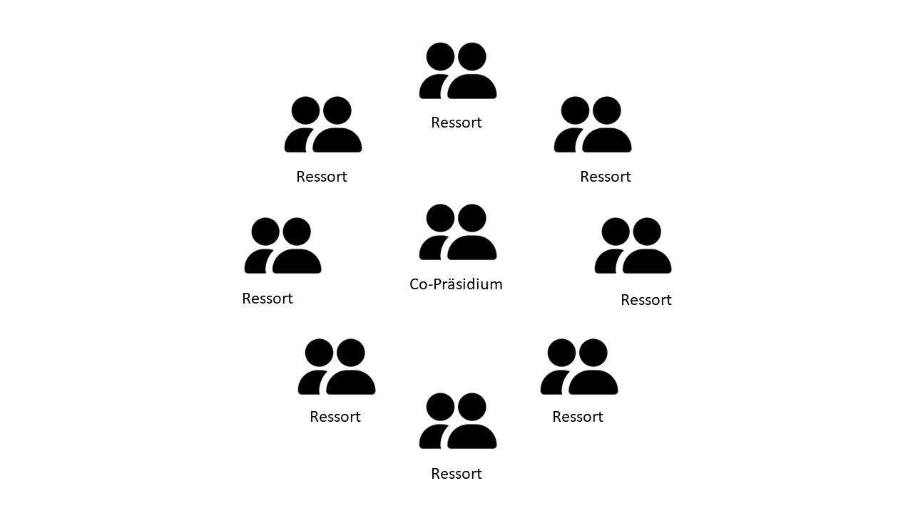

+++
title = "Wie ein jeder diese Welt bewegen kann"
date = "2024-03-15"
draft = false
pinned = false
tags = ["LGBTQIA+", "Awareness", "Interve", "Queer", "Aktivismus"]
image = "microsoftteams-image-34-.png"
description = ""
+++


Ein Interview mit einer Person die mit hilft die Bern Pride zu organisieren und wie alles mit einem Instagram Post begann.





Name: Lena Maria Carnal

Alter: 24

Bern Pride OK: Mitverantwortliche für Awareness



Der gesammte eingang zum Caffe waren überall mit Graffity beschmückt, dass Lokall selbst war von innen Gemütlich eingerichtet, hier und dort waren Flyer aufgehängt und es waren alle arten von Meschen zu sehen, die sich alle zusammen im Lokal einegfunden haben.

*Alex Rudovich*

**Was machen Sie Hauptberuflich?** 

Ich habe letztens Sommer die Lehre abgeschlossen, als Zeichnerin, in Fachrichtung Landschaftsarchitektur. Ich arbeite jetzt 80% in einem Landschaftsarchitekturbüro. Und denn Freinen Tag kann ich dann benutzen um etwas für die Bern Pride zu machen.

**Wie sind Sie eigentlich zu diesem Beruf gekommen?** 

Ich habe zuerst das Gymnasium besucht, unteranderem weil ich nicht wusste, was ich eigentlich in der Zukunft genau machen wollte. Später, gegen das Ende des Gymnasiums habe ich aber gemerkt dass es für mich sehr viel war. Dann realisierte ich, dass ich nicht studieren möchte und habe deswegen auch das letzte Jahr nicht wiederholt, sondern habe eine Berufslehre angefangen als Zeichnerin, Fachrichtung Landschaftsarchitektur. Unteranderem weil man da den Aussenbereich plant und mitgestalten kann. Und ich finde der Aussenbereich, der für jeden da ist sehr wertvoll und es ist schön ein Teil davon zu sein. 



Die erste offizielle Bern Pride war 2023, sie wurde von den Eurogames finanziert weswegen ein grösseres fest organsiert werden konnte. Eurogames ist ein Sportverein der Queere Events sponsern, jedes Jahr in einem anderen Land. Da eine Gruppe für Bern Pride schon gebildet wurde, Orgniseren sie jetzt einfach die Zukünftige Bern Prides.



**Wie ist es dazu gekommen das sie ein mitglied von Bern Pride wurden?**

Angefanngen hat alles mit einem Instagram Post, wo sie einnen Aufruf gemacht haben das sie ein Infotreffen organiseren und Workshop gemacht in der Brasserie Lorrsine. Dann ding ich Letztes Jahre mitte Herbst an diesen Workshop und hab mich dannach gemeldet um im Organisations Komite kurz OK mitzu machen. Dann hat es im Dezember ein Online Treffen, wo man schonmal schauen konnte wer zu welchem Ressort past.



Die Bern Pride hat Zwei Peronen im Co-Präsidium und Acht Ressort in welchen wiederum midestens zwei Perosnnen sind. Insgesammt im **O**rganisations **K**omite sind 27 Personnen, in manchen Ressors hattes mehr als zwei personen und ausserdem gibt es Personnen die mithelfen aber nicht Co-Verantwortlich für das OK sind.



Im Januar hatten wir dann das erste OK treffen in der Brasserie undzwar in einem Raum den sie hier vemieten. Obwohl es viel zutun gab und sich sogut wie nimand kannte, gabe es eine angenehme und entspante stimmung und alle waren motiviert dort zu sein, schlisslich waren alle auch freiwillig da. Wir hatten dann die Finanzen, ressort aufbau und Themen für die Bern Pride angeschaut.

**Was hat sie dazu Bewegt Acctive bei der Bern Pride mit zumachen?**

Schon länger interesiere ich mich für politic und es gibt gennerel viele Themen die wichtig für mich sind. Wehrend der lehre ist mir klar geworden, dass ich mich führ mehr angajiren wolte als ich bisjetzt gemacht hatte, ich bin bei Protest acctionen mitgelaufent, auf instagram habe ich mich auch über acctionen und wann sie stadfinden infromiert und ich unterschriebe Peditionen, aber ich wollte selber mithelfen was zu organiseren. Meine Vertivfungsarbeit wehrend der lehre habe ich dann über Queeren Aktivismus geschrieben, mit focus auf Aktivismus gegen Queere gewlt, mit dem hintergedaken as ich das slber mal machen wollte, ich wusste aber nicht genau wo.

> `Awareness bedeutet Achtsamkeit. Das bedeutet, dass wir uns bewusst sind, dass es verschiedene Menschen gibt, auch mit verschiedenen Hintergründen, verschiedenen Bedürfnissen und Wahrnehmungen, und dass wir das Respektieren. Das bedeutet, dass wir hinschauen und nicht einfach ausgehen, dass alle eh friedlich und nett zueinander sind, sondern dass wir uns auch dafür einsetzen, dass es so ist. Dass wir zum Beispiel Übergriffe oder Diskriminierung vermeiden und einschreiten, wenn es zu solchen Vorfällen kommt.``Was Bedutet Awarness für `*Lena Maria Carnal``*